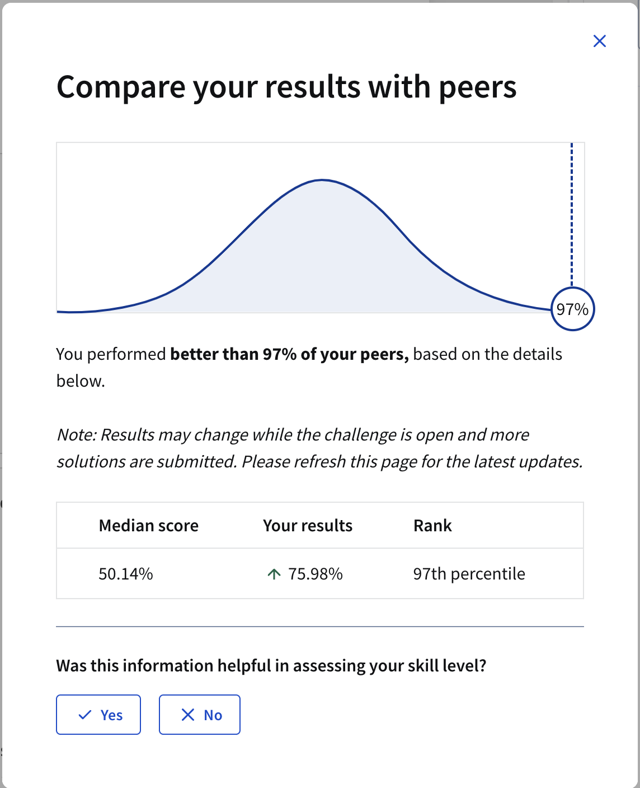

- [Loan Default Prediction - Data Science Challenge](#loan-default-prediction---data-science-challenge)
  - [Dataset](#dataset)
  - [Project Structure](#project-structure)
    - [Files Structure](#files-structure)
  - [Model Development and Iteration](#model-development-and-iteration)
  - [Final Model](#final-model)
  - [Key Techniques Used](#key-techniques-used)
  - [Conclusion](#conclusion)
  - [License](#license)

# Loan Default Prediction - Data Science Challenge

This repository contains my solution to the [Data Science Coding Challenge: Loan Default Prediction](https://www.coursera.org/projects/data-science-coding-challenge-loan-default-prediction) from Coursera. The goal is to build a model that accurately estimates the probability of a borrower defaulting on their loan, given a dataset of historical loan information. The project explores various techniques, including feature engineering, hyperparameter tuning, model calibration, and ensemble methods, to achieve a high ROC AUC score.

## Dataset

The challenge uses two datasets: `train.csv` and `test.csv`.  `train.csv` contains the historical loan data, including a binary `Default` column indicating whether the loan defaulted (1) or not (0). `test.csv` has the same features as `train.csv`, but without the `Default` column.  The task is to predict the probability of default for each loan in `test.csv`. The datasets include features like:

*   `LoanID`: A unique identifier for each loan.
*   `Age`: The age of the borrower.
*   `Income`: The annual income of the borrower.
*   `LoanAmount`: The amount of money borrowed.
*   `CreditScore`: The credit score of the borrower.
*   `MonthsEmployed`: The number of months the borrower has been employed.
*   `NumCreditLines`: The number of credit lines the borrower has open.
*   `InterestRate`: The interest rate for the loan.
*   `LoanTerm`: The term length of the loan in months.
*   `DTIRatio`: The Debt-to-Income ratio.
*   `Education`: The highest level of education attained by the borrower.
*   `EmploymentType`: The type of employment.
*   `MaritalStatus`: The marital status of the borrower.
*   `HasMortgage`: Whether the borrower has a mortgage.
*   `HasDependents`: Whether the borrower has dependents.
*   `LoanPurpose`: The purpose of the loan.
*   `HasCoSigner`: Whether the loan has a co-signer.

## Project Structure

The main code is contained within a single Python script (or Jupyter Notebook).  The code is structured as follows:

1.  **Data Loading and Preprocessing:**
    *   Loads the `train.csv` and `test.csv` datasets using pandas.
    *   Handles categorical features using one-hot encoding (with `pd.get_dummies` and `drop_first=True` to avoid multicollinearity).
    *   Drops the `LoanID` column, as it's not a predictive feature.
    *   Scales numerical features using `StandardScaler`.

2.  **Feature Engineering:**
    *   Creates new features based on interactions and combinations of existing features. The goal is to capture non-linear relationships that might improve model performance.

3.  **Model Training and Evaluation:**
    *   Uses `train_test_split` to create a validation set for model evaluation.
    *   Experiments with different machine learning models and hyperparameter tuning techniques.
    *   Evaluates models using the ROC AUC metric.

4.  **Prediction and Submission:**
    *   Makes predictions on the `test.csv` dataset.
    *   Creates a submission file (`prediction_submission.csv`) in the required format.

### Files Structure

The repository contains the following key files:

* [LoanDefaultPrediction_v1.ipynb](LoanDefaultPrediction_v1.ipynb) - Baseline Ensemble (RandomForest + GradientBoosting)
* [LoanDefaultPrediction_v2.ipynb](LoanDefaultPrediction_v2.ipynb) - Model Selection and Cross-Validation
* [LoanDefaultPrediction_v3.ipynb](LoanDefaultPrediction_v3.ipynb) - Hyperparameter Tuning with RandomizedSearchCV
* [LoanDefaultPrediction_v4.ipynb](LoanDefaultPrediction_v4.ipynb) - Feature Engineering and Focused Tuning
* [LoanDefaultPrediction_v5_Final.ipynb](LoanDefaultPrediction_Final.ipynb) - Calibration and Wider Tuning (Final Model)
* [train.csv](train.csv) - Training dataset
* [test.csv](test.csv) - Test dataset

## Model Development and Iteration

The project followed an iterative approach, starting with simple models and gradually increasing complexity. Here's a summary of the key variants and the reasoning behind the changes:

**Variant 1: Baseline Ensemble (RandomForest + GradientBoosting)**

*   **Hypothesis:** A simple ensemble of RandomForest and GradientBoosting, with some basic parameter tuning, would provide a reasonable baseline performance.
*   **Logic:**
    *   Used `RandomForestClassifier` and `GradientBoostingClassifier`.
    *   Used a `VotingClassifier` with `voting='soft'` to combine the predictions.
    *   Basic hyperparameter tuning for both models.
*   **Code (Simplified):**

    ```python
    # ... (Preprocessing as described above) ...

    rf_clf = RandomForestClassifier(random_state=42, n_estimators=150, max_depth=10, min_samples_leaf=5)
    gb_clf = GradientBoostingClassifier(random_state=42, n_estimators=100, learning_rate=0.1, max_depth=3)
    voting_clf = VotingClassifier(estimators=[('rf', rf_clf), ('gb', gb_clf)], voting='soft')
    voting_clf.fit(X, y)  # X and y are the scaled features and target
    predicted_probability = voting_clf.predict_proba(test_df_scaled)[:, 1]
    ```

*   **Result:** ROC AUC = 0.7561 (88th percentile)

**Variant 2: Model Selection and Cross-Validation**

*   **Hypothesis:** Evaluating multiple models (RandomForest, GradientBoosting, AdaBoost) and a VotingClassifier, using a validation set, would allow for better model selection.
*   **Logic:**
    *   Introduced `train_test_split` to create a validation set.
    *   Created an `evaluate_model` function to train and evaluate each model on the validation set.
    *   Compared the ROC AUC of each model and selected the best-performing one.
*   **Code (Simplified):**

    ```python
    # ... (Preprocessing, train_test_split) ...

    def evaluate_model(model, X_train, y_train, X_val, y_val):
        # ... (Train and evaluate model, return AUC) ...

    # ... (Train and evaluate RandomForest, GradientBoosting, AdaBoost, VotingClassifier) ...

    # Select the best model based on validation AUC
    ```

*   **Result:** ROC AUC = 0.7583 (93rd percentile) - GradientBoosting performed best.

**Variant 3: Hyperparameter Tuning with RandomizedSearchCV**

*   **Hypothesis:** Using `RandomizedSearchCV` for more systematic hyperparameter tuning would improve the performance of the individual models and the ensemble.
*   **Logic:**
    *   Replaced manual parameter tuning with `RandomizedSearchCV`.
    *   Defined parameter grids for both RandomForest and GradientBoosting.
    *   Tuned each model separately and then used the tuned models in a `VotingClassifier`.
*   **Code (Simplified):**

    ```python
    # ... (Preprocessing, train_test_split) ...

    def tune_model(model, param_grid, X_train, y_train, X_val, y_val, n_iter=20):
       # ... (Use RandomizedSearchCV, return best model and AUC) ...

    # Tune GradientBoosting
    best_gb_clf, gb_auc = tune_model(GradientBoostingClassifier(random_state=42), gb_param_grid, ...)

    # Tune RandomForest
    best_rf_clf, rf_auc = tune_model(RandomForestClassifier(random_state=42), rf_param_grid, ...)

    # Create and evaluate VotingClassifier with tuned models
    ```

*   **Result:** ROC AUC = 0.7585 (93rd percentile) - GradientBoosting still performed best.

**Variant 4: Feature Engineering and Focused Tuning**

*   **Hypothesis:** Creating new features and focusing the hyperparameter search around the best values from the previous run would further improve performance.
*   **Logic:**
    *   Added feature engineering (interaction terms and polynomial features) in the `preprocess_data` function.
    *   Narrowed the parameter ranges in `RandomizedSearchCV` based on the previous results.
    *   Visualized feature importances using a plot.
*   **Code (Simplified):**

    ```python
    def preprocess_data(df):
       # ... (One-hot encoding) ...
       # Feature Engineering
       df['Income_x_CreditScore'] = df['Income'] * df['CreditScore']
       df['LoanAmount_x_Income'] = df['LoanAmount'] / (df['Income'] + 1e-9)
       df['LoanAmount_x_CreditScore'] = df['LoanAmount'] * df['CreditScore']
       df['MonthsEmployed_x_Age'] = df['MonthsEmployed'] / (df['Age'] + 1e-9)
       df['DTIRatio_squared'] = df['DTIRatio'] ** 2
       return df

    # ... (train_test_split, scaling) ...
    # Narrower parameter grids for RandomizedSearchCV
    # ... (tune_model function) ...
    # ... (Plot feature importances - optional) ...
    ```

*   **Result:** ROC AUC = 0.759 (95th percentile) - Best result so far.  Feature engineering significantly improved the model.

**Variant 5 (Final):  Calibration and Wider Tuning**

*  **Hypothesis:** Reverting some of the aggressive feature culling, using a calibrated model, and performing wider-range hyperparameter tuning would help.  The idea here is that removing too many features might discard important information.
*  **Logic:**
    *   Kept all original features (after one-hot encoding) and the most successful engineered features.
    *   Used wider parameter ranges in `RandomizedSearchCV` and increased the number of iterations.
    * Used `CalibratedClassifierCV` with an *unfitted* base estimator to improve probability calibration, if that improved the AUC score on the validation set.
*   **Code (Simplified):**

    ```python
     def preprocess_data(df):
        if 'LoanID' in df.columns:
            df = df.drop('LoanID', axis=1)
        categorical_cols = ['Education', 'EmploymentType', 'MaritalStatus', 'HasMortgage', 'HasDependents', 'LoanPurpose', 'HasCoSigner']
        df = pd.get_dummies(df, columns=categorical_cols, drop_first=True)

        # Feature Engineering (Keep successful ones, remove the low-importance one)
        df['Income_x_CreditScore'] = df['Income'] * df['CreditScore']
        df['LoanAmount_x_Income'] = df['LoanAmount'] / (df['Income'] + 1e-9)
        df['LoanAmount_x_CreditScore'] = df['LoanAmount'] * df['CreditScore']
        df['MonthsEmployed_x_Age'] = df['MonthsEmployed'] / (df['Age'] + 1e-9)
        df['DTIRatio_squared'] = df['DTIRatio'] ** 2
        return df

    # ... (train_test_split, scaling)

    gb_param_grid = { #Wider Ranges
        'n_estimators': [100, 150, 200, 250, 300, 350, 400],
        'learning_rate': [0.01, 0.03, 0.05, 0.07, 0.1, 0.15],
        'max_depth': [3, 4, 5, 6, 7],
        'min_samples_split': [2, 3, 4, 5, 6],
        'min_samples_leaf': [1, 2, 3, 4, 5],
        'subsample': [0.7, 0.75, 0.8, 0.85, 0.9, 0.95, 1.0],
        'max_features': ['sqrt', 'log2', None]
    }
    # ... (tune_model function, n_iter=50) ...
    best_gb_clf, gb_auc, best_gb_params = tune_model(GradientBoostingClassifier(random_state=42), gb_param_grid, X_train, y_train, X_val, y_val, n_iter=50)


    calibrated_gb_clf = CalibratedClassifierCV(
        GradientBoostingClassifier(**best_gb_params, random_state=42),
        method="isotonic",
        cv=3
    )
    calibrated_gb_clf.fit(X_train, y_train) #Fit on X_train and y_train

    # ... (Evaluate calibrated model on validation set, choose best model) ...
    ```

* **Result:** ROC AUC = 0.7598 (97th percentile) - Further improvement, achieving the best score.  Calibration helped slightly in this case.


## Final Model

The final model is a `CalibratedClassifierCV` wrapping a `GradientBoostingClassifier`. The `GradientBoostingClassifier` was tuned using `RandomizedSearchCV` with the following parameter ranges (Variant 5):

*   `n_estimators`: \[100, 150, 200, 250, 300, 350, 400]
*   `learning_rate`: \[0.01, 0.03, 0.05, 0.07, 0.1, 0.15]
*   `max_depth`: \[3, 4, 5, 6, 7]
*   `min_samples_split`: \[2, 3, 4, 5, 6]
*   `min_samples_leaf`: \[1, 2, 3, 4, 5]
*   `subsample`: \[0.7, 0.75, 0.8, 0.85, 0.9, 0.95, 1.0]
*   `max_features`: \['sqrt', 'log2', None]

The `CalibratedClassifierCV` uses the `isotonic` calibration method and 3-fold cross-validation.

## Key Techniques Used

*   **Feature Engineering:** Creating new features by combining existing ones.
*   **One-Hot Encoding:** Converting categorical features into numerical features.
*   **Standard Scaling:** Scaling numerical features to have zero mean and unit variance.
*   **Gradient Boosting:** Using the `GradientBoostingClassifier` algorithm.
*   **Random Forest:** Using the `RandomForestClassifier` algorithm.
*   **Ensemble Methods:** Combining multiple models using `VotingClassifier`.
*   **Hyperparameter Tuning:** Using `RandomizedSearchCV` to find optimal model parameters.
*   **Cross-Validation:** Using `train_test_split` and the `cv` parameter in `RandomizedSearchCV` and `CalibratedClassifierCV`.
*   **Model Calibration:** Using `CalibratedClassifierCV` to improve the accuracy of predicted probabilities.
* **Feature Importance Analysis:** Examining feature importances to gain insights and guide feature selection.

## Conclusion

This project demonstrates a systematic approach to building a machine-learning model for loan default prediction.  By iteratively exploring different techniques, including feature engineering, hyperparameter tuning, and model calibration, we were able to achieve a high ROC AUC score, placing in the top 3% of the competition.  The final model, a calibrated Gradient Boosting Classifier, provides a robust and accurate solution for predicting loan defaults.

## License

This project is licensed under the MIT License - see the [LICENSE](LICENSE) for details.